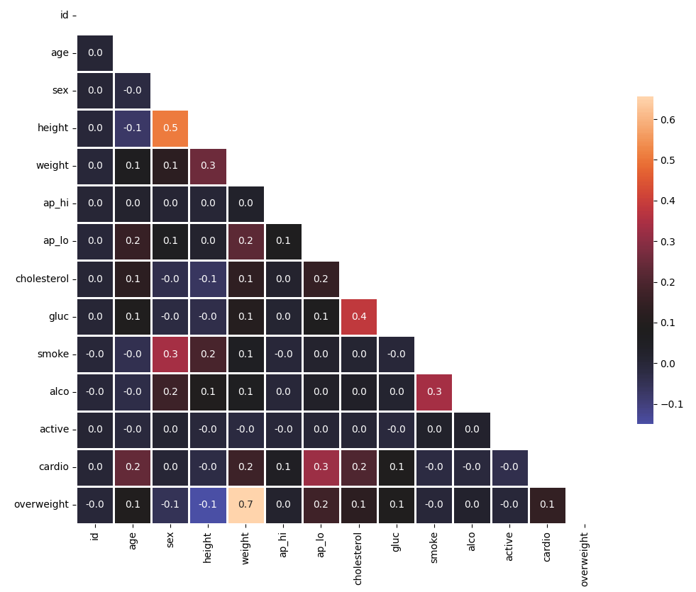

## data_analytics_projects_freecodecamp

This repository is a part of free code camp Data Analysis certification projects using python. Learning about the effective use of numpy and pandas libraries to analyse data.

Here I have putted all the solutions of 5 projects.

## Image descriptions

Medical Data Visualizer Catplot

Medical Data Visualizer Heatmap

Page Views Time Series Visualizer Bar-Plot

Page Views Time Series Visualizer Box-Plot

Page Views Time Series Visualizer Line-Plot

Sea Level Predictor Sea Level Plot
