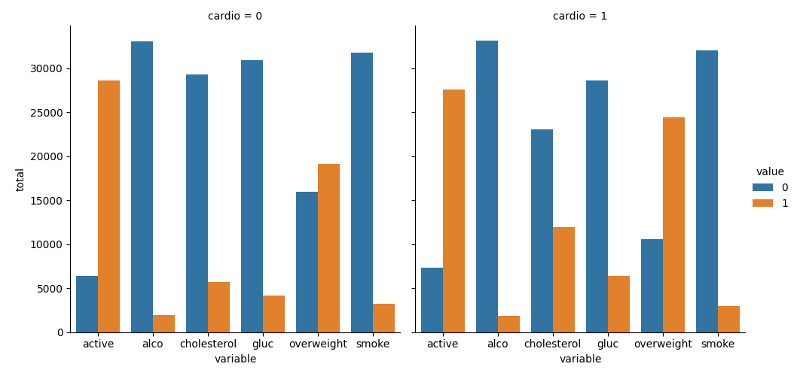
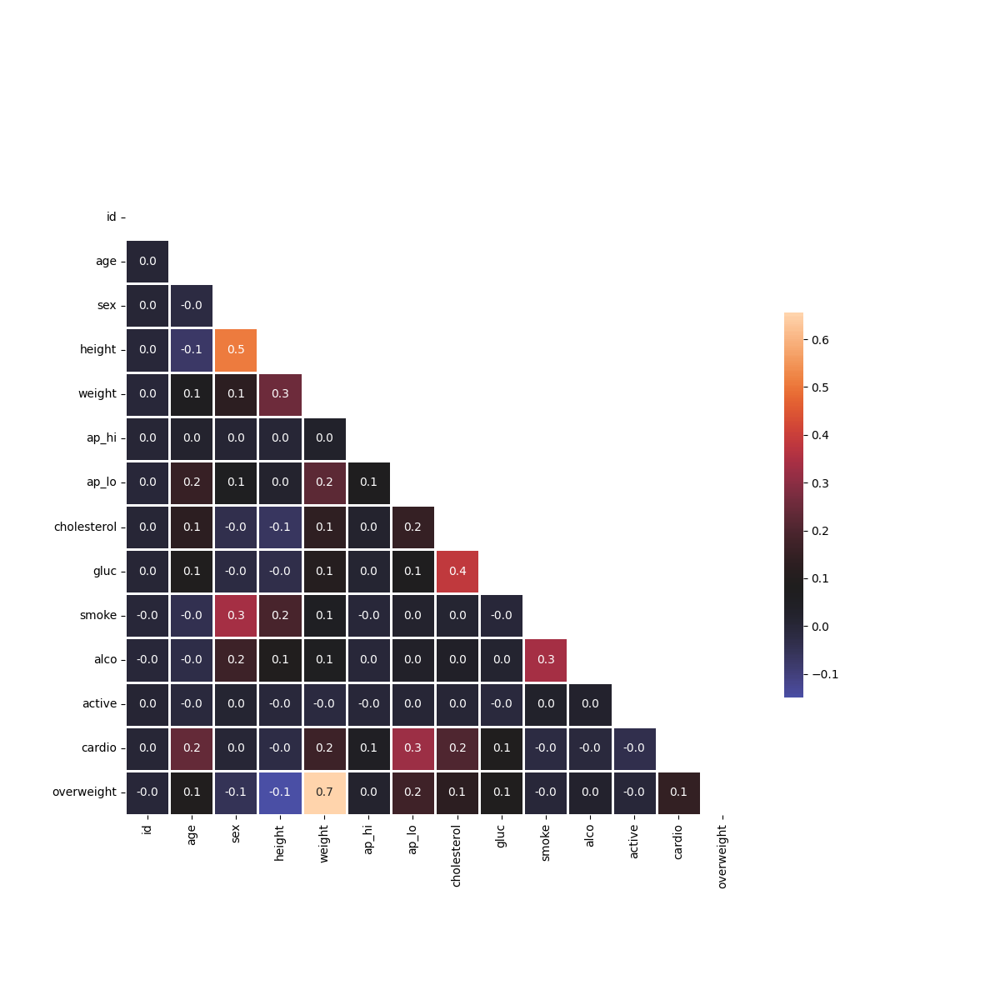
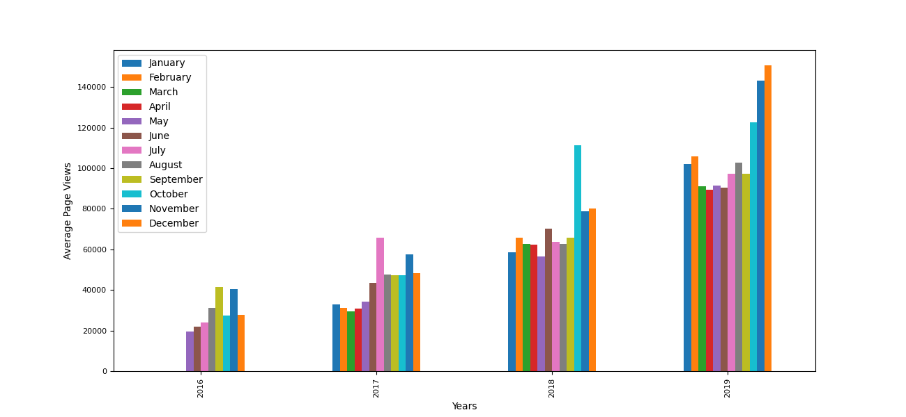
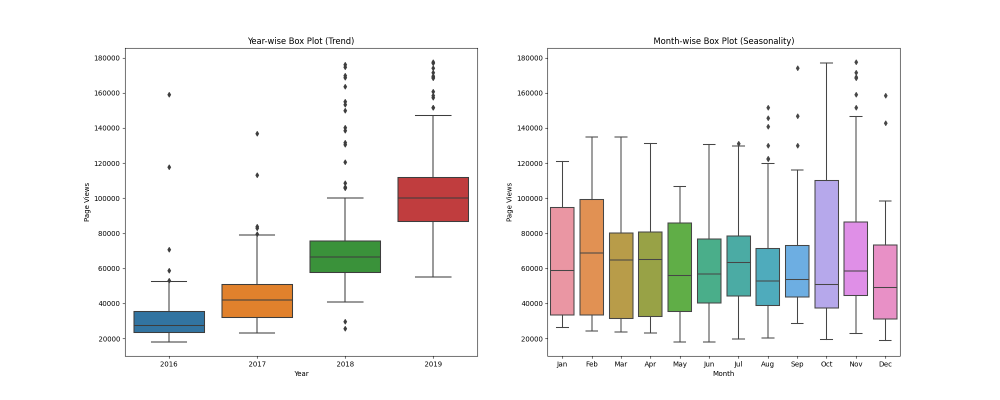
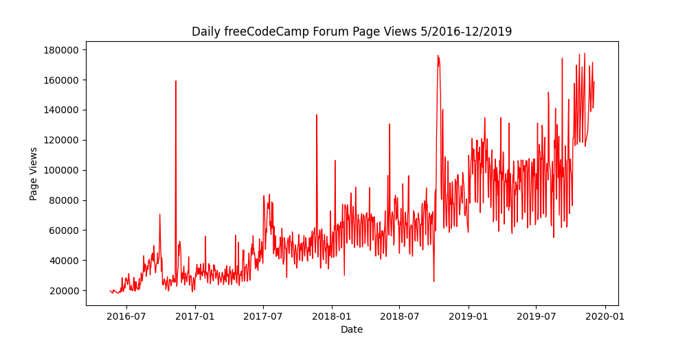
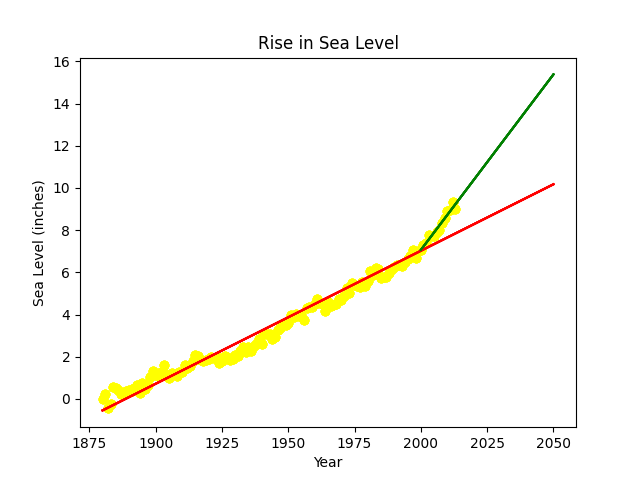

## data_analytics_projects_freecodecamp

This repository is a part of free code camp Data Analysis certification projects using python. Learning about the effective use of numpy and pandas libraries to analyse data.

Here I have putted all the solutions of 5 projects.

